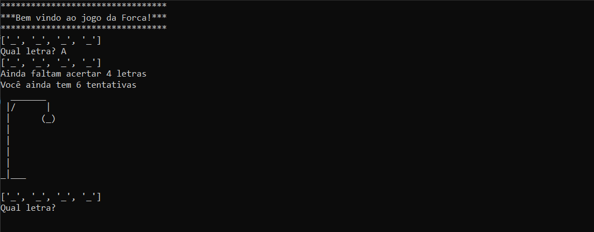

# JOGO DA FORCA - VOLUME 2
👨‍💻ESSE É PEQUENO JOGO QUE RODA NO CONSOLE DA IDE.

 <br>

## DESCRIÇÃO:
Este programa implementa o clássico jogo da forca em Python. Ele carrega uma palavra aleatória de um arquivo chamado "WORD.txt", inicializa uma lista para armazenar as letras acertadas, e pede ao usuário para adivinhar letras até que ele acerte todas as letras ou atinja o número máximo de erros permitidos (7 erros). O jogo exibe mensagens de abertura, vitória ou derrota, desenha uma forca conforme o número de erros e revela a palavra secreta quando o jogador perde. O usuário pode tentar adivinhar letras, e o jogo fornece feedback sobre as letras corretas e o progresso.

## EXECUTANDO O JOGO:
1. Navegue até o diretório `./CODIGO` e execute o arquivo Python com o seguinte comando:

   ```bash
   python CODIGO.py
   ```

2. O jogo será iniciado com uma mensagem de boas-vindas.

3. Uma palavra será escolhida aleatoriamente a partir do arquivo `WORD.txt`.

4. Você verá uma sequência de underlines (`_`), representando cada letra da palavra a ser adivinhada.

5. Digite uma letra como palpite e pressione Enter.

6. Se a letra estiver correta, ela aparecerá nas posições correspondentes da palavra.

7. Se a letra estiver incorreta, uma parte do desenho da forca será exibida.

8. Você pode continuar tentando até:

   * **Acertar todas as letras** da palavra (vitória), ou
   * **Cometer 7 erros**, o que resultará em enforcamento (derrota).

9. Ao final da partida:

   * Se vencer, verá uma mensagem de parabéns.
   * Se perder, a palavra correta será revelada.

10. O jogo exibirá uma mensagem de encerramento.

## SOBRE O EXECUTAVEL:
### 1. EXECUTANDO:
   * O executável gerado está disponível apenas para sistemas **Windows x64** e pode ser encontrado no diretório `./APP`. Para executá-lo, basta dar dois cliques. O executável é bastante útil caso o Python não esteja instalado. Trata-se da mesma aplicação do arquivo `./CODIGO/CODIGO.py`. Se desejar, você pode recompilá-lo novamente.
   * Para executá-lo, basta dar dois cliques. Ele é especialmente útil em máquinas onde o **Python não está instalado**.
   * Trata-se da **mesma aplicação contida no arquivo `./CODIGO/CODIGO.py`**, porém empacotada de forma independente.
   * Se necessário, você pode recompilar o executável a qualquer momento.

### 2. GERANDO:
> **IMPORTANTE:** Antes de gerar o novo `executável`, certifique-se de excluir o arquivo `./APP/JOGO DA FORCA 2.exe`.

   **1. Instalação do [PyInstaller:](https://pyinstaller.org/en/stable/)**
   - Certifique-se de ter o PyInstaller instalado. Se não tiver, instale usando o comando abaixo:
   ```bash
   pip install pyinstaller
   ```

   **2. Gerando o Executável:**
   - No diretório `./CODIGO`, execute o comando abaixo para gerar o executável a partir do arquivo `.spec`:

   ```bash
   pyinstaller EXECUTAVEL.spec
   ```

   - O arquivo `JOGO DA FORCA 2.exe` será criado dentro da pasta `./CODIGO/dist`.

   - Após a geração, você pode mover o executável para `./APP` e remover as pastas temporárias `./CODIGO/build` e `./CODIGO/dist`.

   - Para executar o aplicativo, basta dar dois cliques no arquivo `.exe`.

## NÃO SABE?
- Entendemos que para manipular arquivos em muitas linguagens e tecnologias, é necessário possuir conhecimento nessas áreas. Para auxiliar nesse aprendizado, oferecemos cursos gratuitos disponíveis:
* [CURSO DE PYTHON](https://github.com/VILHALVA/CURSO-DE-PYTHON)
* [CONFIRA MAIS CURSOS](https://github.com/VILHALVA?tab=repositories&q=+topic:CURSO)

## CREDITOS:
- [PROJETO CRIADO PELO VILHALVA](https://github.com/VILHALVA)

